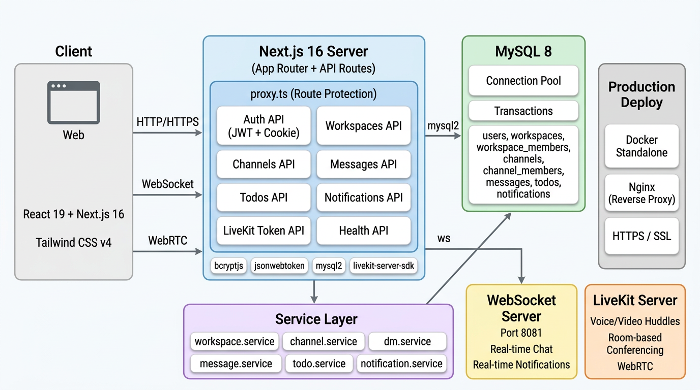

# Workspace — Real-time Collaboration Platform

A full-stack community and collaboration platform built with **Next.js 16**, featuring real-time messaging, voice/video huddles, workspace management, and task tracking.



## Features

- **Workspaces** — Create and manage team workspaces with role-based access (owner / admin / member)
- **Channels** — Public channels for group conversations with real-time messaging via WebSocket
- **Direct Messages** — Private 1:1 conversations between workspace members
- **Voice / Video Huddles** — LiveKit-powered real-time audio and video conferencing with PiP mode
- **TODO Management** — Kanban-style task board (Todo → Doing → Done) with rich text descriptions
- **Notifications** — Real-time notification system via WebSocket
- **Authentication** — JWT + HttpOnly cookie with single-session enforcement (tokenVersion)
- **Mentions** — @mention users in messages with autocomplete
- **Message Search** — Full-text search within channels and DMs
- **Admin Panel** — User management for administrators

## Tech Stack

| Layer | Technology |
|-------|-----------|
| **Frontend** | React 19, Next.js 16 (App Router), Tailwind CSS v4 |
| **Backend** | Next.js API Routes, TypeScript |
| **Database** | MySQL 8 (mysql2 connection pool) |
| **Auth** | JWT (jsonwebtoken), bcryptjs, HttpOnly cookies |
| **Real-time** | WebSocket (ws) for chat & notifications |
| **Voice/Video** | LiveKit (livekit-server-sdk, @livekit/components-react) |
| **Testing** | Vitest, @vitest/coverage-v8 |
| **Routing** | proxy.ts (Next.js 16 route protection) |

## Project Structure

```
nextjs/user/
├── app/                          # Next.js App Router
│   ├── api/                      # API Routes (20+ endpoints)
│   │   ├── auth/                 # login, register, logout, me, ws-token, forgot/reset-password
│   │   ├── workspaces/           # CRUD, channels, members, dm
│   │   ├── channels/             # messages, channel details
│   │   ├── todos/                # CRUD with status management
│   │   ├── notifications/        # notification list
│   │   ├── livekit/              # LiveKit token generation
│   │   └── health/               # health check
│   ├── login/                    # Login page
│   ├── register/                 # Registration page
│   ├── forgot-password/          # Password reset
│   ├── mypage/                   # User profile
│   ├── admin/                    # Admin panel
│   └── workspaces/               # Workspace pages
│       └── [id]/
│           ├── channels/[channelId]/   # Channel chat
│           ├── dm/[channelId]/         # Direct messages
│           ├── todos/                  # Task board
│           └── members/                # Member management
├── src/
│   ├── components/               # UI components
│   │   ├── WorkspaceSidebar      # Navigation sidebar
│   │   ├── WorkspaceHeader       # Top header bar
│   │   ├── MessageInput          # Rich text message input with @mentions
│   │   ├── RichTextEditor        # contentEditable rich text editor
│   │   ├── HuddleRoom           # LiveKit voice/video room
│   │   ├── HuddleControlBar     # Audio/video device controls
│   │   ├── HuddleLayoutWrapper  # PiP huddle overlay
│   │   ├── NotificationBell     # Real-time notification badge
│   │   └── SessionCheck         # Periodic session validation
│   ├── contexts/                 # React Context
│   │   └── HuddleLayoutContext   # Huddle state management
│   ├── hooks/                    # Custom hooks
│   │   ├── useChannelWs          # Channel WebSocket (messages)
│   │   └── useNotificationWs     # Notification WebSocket
│   ├── services/                 # Business logic layer
│   │   ├── workspace.service     # Workspace CRUD
│   │   ├── channel.service       # Channel CRUD
│   │   ├── dm.service            # DM channel management
│   │   ├── message.service       # Message CRUD & search
│   │   ├── todo.service          # TODO CRUD
│   │   └── notification.service  # Notification management
│   └── lib/                      # Utilities
│       ├── auth.ts               # JWT verification, user extraction
│       ├── db.ts                 # MySQL connection pool
│       ├── cookie.ts             # Cookie configuration
│       ├── permissions.ts        # Authorization helpers
│       └── sanitize.ts           # HTML sanitization
├── database/migrations/          # SQL migration files
├── proxy.ts                      # Next.js 16 route protection middleware
├── schema.sql                    # Full database schema
└── docs/
    ├── architecture.png          # Architecture diagram
    └── FEATURES_IDEAS.md         # Feature roadmap
```

## Database Schema

8 tables with foreign key relationships:

| Table | Purpose |
|-------|---------|
| `users` | User accounts (name, email, password_hash, role, tokenVersion) |
| `workspaces` | Team workspaces |
| `workspace_members` | Workspace membership (owner / admin / member roles) |
| `channels` | Channels & DM channels (isDM, dmUser1Id, dmUser2Id) |
| `channel_members` | Channel membership |
| `messages` | Messages with thread support (parentMessageId) |
| `todos` | Tasks with status tracking (todo / doing / done) |
| `notifications` | User notifications |

## Getting Started

### Prerequisites

- Node.js 20+
- MySQL 8 (or Docker)
- LiveKit Server (for voice/video features)

### 1. Install dependencies

```bash
cd user
npm install
```

### 2. Configure environment

Create `.env.local`:

```env
DB_HOST=localhost
DB_PORT=3307
DB_NAME=user
DB_USER=root
DB_PASSWORD=your_password
JWT_SECRET=your_jwt_secret
```

Create `.env.development` or add to `.env.local`:

```env
WS_PORT=8081
NEXT_PUBLIC_WS_HOST=localhost
NEXT_PUBLIC_WS_PORT=8081
LIVEKIT_API_KEY=your_livekit_key
LIVEKIT_API_SECRET=your_livekit_secret
LIVEKIT_URL=ws://localhost:7880
```

### 3. Set up the database

```bash
mysql -u root -p user < schema.sql
```

Or run migrations individually:

```bash
mysql -u root -p user < database/migrations/create_service_tables.sql
mysql -u root -p user < database/migrations/add_password_hash.sql
mysql -u root -p user < database/migrations/add_token_version.sql
mysql -u root -p user < database/migrations/add_dm_channels.sql
mysql -u root -p user < database/migrations/create_notifications.sql
```

### 4. Run the development server

```bash
npm run dev
```

The app will be available at `https://localhost:3000`.

### 5. Run WebSocket server (for real-time features)

```bash
npm run ws:dev
```

## API Endpoints

### Auth
| Method | Path | Description |
|--------|------|-------------|
| POST | `/api/auth/register` | Create account |
| POST | `/api/auth/login` | Sign in (sets HttpOnly cookie) |
| POST | `/api/auth/logout` | Sign out |
| GET | `/api/auth/me` | Current user info |
| GET | `/api/auth/ws-token` | WebSocket auth token |
| POST | `/api/auth/forgot-password` | Check email existence |
| POST | `/api/auth/reset-password` | Reset password |

### Workspaces
| Method | Path | Description |
|--------|------|-------------|
| GET / POST | `/api/workspaces` | List / Create workspaces |
| GET | `/api/workspaces/[id]` | Workspace details |
| GET / POST | `/api/workspaces/[id]/channels` | List / Create channels |
| GET | `/api/workspaces/[id]/members` | List members |
| POST | `/api/workspaces/[id]/dm` | Open DM channel |

### Channels & Messages
| Method | Path | Description |
|--------|------|-------------|
| GET / DELETE | `/api/channels/[id]` | Channel details / Delete |
| GET / POST | `/api/channels/[id]/messages` | List / Send messages |

### Todos
| Method | Path | Description |
|--------|------|-------------|
| GET / POST | `/api/todos` | List / Create todos |
| PATCH / DELETE | `/api/todos/[id]` | Update / Delete todo |

### Other
| Method | Path | Description |
|--------|------|-------------|
| POST | `/api/livekit/token` | Generate LiveKit room token |
| GET | `/api/notifications` | List notifications |
| GET | `/api/health` | Health check |

## Scripts

```bash
npm run dev        # Start dev server (HTTPS)
npm run build      # Production build
npm run start      # Start production server
npm run ws:dev     # Start WebSocket server
npm run test       # Run tests (Vitest)
npm run test:watch # Run tests in watch mode
npm run lint       # ESLint
```

## License

MIT
